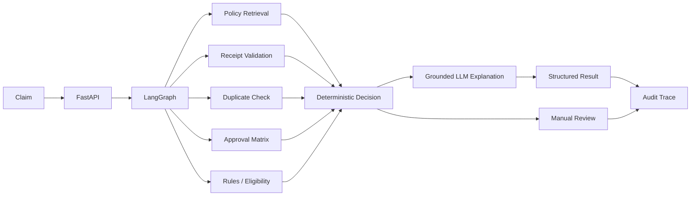

# Travel Reimbursement Approval Agent

A one-day GenAI Architect take-home assignment demonstrating a **bounded agentic workflow for enterprise travel reimbursement decision assistance**.

## Architecture Principle

> **GenAI interprets and explains; deterministic services validate and calculate; ambiguous or high-risk cases go to human review.**

The solution deliberately avoids using the LLM as a financial rules engine.

## What the Prototype Demonstrates

- FastAPI claim intake and Pydantic validation
- LangGraph bounded workflow
- runtime policy retrieval / lightweight RAG
- receipt-validation service boundary
- duplicate check
- approval matrix lookup
- deterministic eligibility calculation
- `APPROVE`, `PARTIALLY_APPROVE`, `REJECT`, `MANUAL_REVIEW`
- policy-grounded GPT explanation
- deterministic fallback when LLM is unavailable
- prompt-injection boundary
- audit trace
- on-prem and Azure deployment designs

## High-Level Flow



## Sample Outcomes

| Claim | Scenario | Decision | Auto-approved |
|---|---|---|---:|
| CLM-1001 | Taxi INR 800, receipt present | APPROVE | INR 800 |
| CLM-1002 | Hotel INR 6,200, policy limit INR 5,000 | PARTIALLY_APPROVE | INR 5,000 |
| CLM-1003 | Unsupported personal expense | REJECT | INR 0 |
| CLM-1004 | Flight INR 12,000, mandatory receipt missing | MANUAL_REVIEW | INR 0 |

## Run Locally

Windows / PowerShell:

```powershell
python -m venv .venv
.venv\Scripts\activate
pip install -r requirements.txt

copy .env.example .env
```

Edit `.env`.

### Without LLM

```env
LLM_PROVIDER=none
```

### Direct OpenAI

```env
LLM_PROVIDER=openai
OPENAI_API_KEY=<your-key>
OPENAI_MODEL=gpt-5.6-luna
```

Then:

```powershell
uvicorn app.main:app --reload
```

Open Swagger:

```text
http://127.0.0.1:8000/docs
```

## APIs

```text
GET  /health
POST /api/v1/claims/evaluate
POST /api/v1/claims/evaluate/trace
```

The trace endpoint is for demonstration. Detailed audit information would be access-controlled in production.

## Test

```powershell
pytest -q
```

## Repository Structure

```text
travel_reimbursement_agent/
├── app/
│   ├── main.py
│   ├── graph.py
│   ├── models.py
│   ├── state.py
│   ├── services/
│   └── tools/
├── data/
│   ├── policies/
│   └── claims/
├── tests/
├── docs/
│   ├── architecture-note.md
│   ├── tool-interface-spec.md
│   ├── sample-input-output-trace.md
│   ├── risks-controls-next-steps.md
│   ├── deployment-architecture.md
│   ├── demo-script.md
│   └── diagrams/
├── ARCHITECTURE_DECISIONS.md
├── requirements.txt
├── .env.example
└── README.md
```

## Deliverables

- [Architecture Note](docs/architecture-note.md)
- [Tool / Interface Specification](docs/tool-interface-spec.md)
- [Sample Inputs, Outputs, and Trace](docs/sample-input-output-trace.md)
- [Risks, Controls, and Production Next Steps](docs/risks-controls-next-steps.md)
- [On-Prem and Azure Deployment Architecture](docs/deployment-architecture.md)
- [Demo Script](docs/demo-script.md)
- [Architecture Decision Records](ARCHITECTURE_DECISIONS.md)

## Key Trade-Offs

- **RAG over fine-tuning:** policy is changeable and must be source-traceable.
- **Single bounded workflow over multi-agent:** lower latency/cost and easier auditability.
- **Deterministic financial rules over LLM decisions:** repeatable, testable, precise.
- **Lightweight lexical retrieval for MVP:** sufficient for a tiny policy corpus; production interface supports hybrid/vector search later.
- **No polished UI:** Swagger is enough to prove feasibility within the one-day assignment scope.

## Production Direction

The same logical architecture can run:
- on-premises with enterprise IAM/search/LLM infrastructure, or
- on Azure using API Management, Container Apps, Azure AI Search, Azure OpenAI/Foundry, Blob Storage, Key Vault, Managed Identity, and Azure Monitor.

See [Deployment Architecture](docs/deployment-architecture.md).
