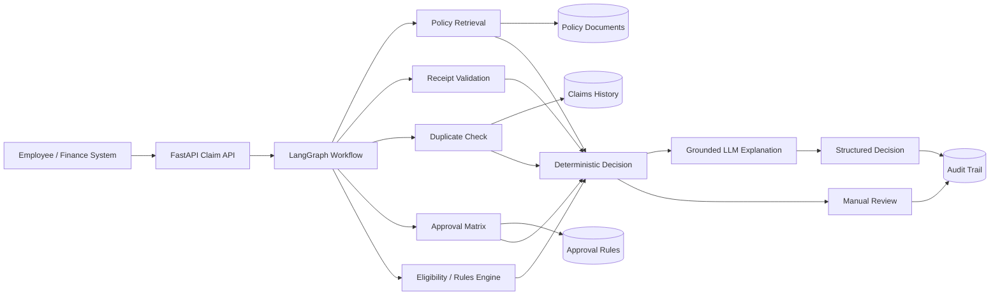

# Travel Reimbursement Approval Agent - Architecture Note

## 1. Problem and Scope

The solution assists Finance teams in reviewing domestic travel reimbursement claims against enterprise travel policy, supporting documents, duplicate history, and approval rules. It recommends one of four outcomes:

**APPROVE | PARTIALLY_APPROVE | REJECT | MANUAL_REVIEW**

Each recommendation includes structured amounts, policy evidence, receipt status, explanation, and a trace ID.

The one-day prototype intentionally supports one expense item per request across four categories:

- Flight
- Hotel
- Meal
- Taxi

The system does not execute payment. Downstream Finance systems remain the system of record for payment processing.

## 2. Architecture Approach

The design uses a **bounded agentic workflow with deterministic financial decisioning**.

> **GenAI interprets and explains; deterministic services validate and calculate; ambiguous or risky cases go to human review.**

## 3. Main Responsibilities

### Claim Intake API
FastAPI receives and validates claims using Pydantic, creates a trace ID, invokes the workflow, and returns a structured response.

### LangGraph Workflow
LangGraph maintains state and executes a controlled sequence of validation, retrieval, calculation, decisioning, and explanation steps. It is deliberately bounded rather than an open-ended autonomous agent.

### Policy Retrieval / RAG
The policy remains external to the LLM. The prototype chunks a Markdown policy by section and retrieves relevant clauses at runtime. Production can replace this with enterprise hybrid/vector search without changing the workflow contract.

Important production metadata includes:
- policy ID and version
- effective-from / effective-to dates
- country and travel type
- employee group
- section identifier

### Receipt Validation
The prototype uses a mocked service boundary. Production would integrate OCR/document intelligence, returning merchant, amount, date, and extraction confidence.

### Duplicate Check
Structured attributes such as employee, category, date, and amount are checked deterministically against historical claims.

### Approval Matrix
Approval thresholds are deterministic and externally configurable. The prototype uses simple amount ranges to demonstrate the interface.

### Eligibility / Rules Engine
Financial arithmetic and hard policy rules are deterministic and testable. The LLM never calculates reimbursement amounts.

### LLM Explanation
The LLM receives an already-established decision, amounts, receipt status, and retrieved policy evidence. It returns only a concise grounded explanation using native structured output. If the model call fails, a deterministic template is returned.

## 4. Decision Strategy

| Condition | Outcome |
|---|---|
| Eligible and evidence complete | APPROVE |
| Some amount exceeds policy | PARTIALLY_APPROVE |
| Explicitly unsupported category | REJECT |
| Mandatory receipt missing | MANUAL_REVIEW |
| Duplicate suspected | MANUAL_REVIEW |
| Policy unresolved/conflicting | MANUAL_REVIEW |
| High-value threshold exceeded | MANUAL_REVIEW |
| Critical validation service unavailable | MANUAL_REVIEW |

The guiding reliability principle is **fail safe, not fail open**.

## 5. Key Architecture Decisions

### Why RAG instead of fine-tuning?
Travel policy is factual, changeable, and must be source-traceable. RAG supports policy updates and provenance without model retraining.

### Why single bounded workflow instead of multi-agent?
The workflow is predictable and financially sensitive. Multi-agent coordination would add cost, latency, and failure modes without a clear independent reasoning need.

### Why deterministic financial decisioning?
Financial controls require repeatability, precision, unit testing, and auditability. Probabilistic model behavior is inappropriate for arithmetic and hard approval rules.

### Why lightweight retrieval in the prototype?
The policy corpus contains only a few sections. A vector database would add setup complexity without improving the one-day proof. The interface is intentionally replaceable by enterprise hybrid/vector search later.

## 6. Security, Reliability, and Governance

- Claims and receipts are treated as untrusted input.
- Prompt instructions isolate trusted policy context from untrusted claim text.
- The LLM cannot change decision, amounts, or policy limits.
- Pydantic enforces structured input/output.
- Missing evidence and ambiguous cases route to Manual Review.
- Only minimum required data is sent to the LLM.
- Production uses enterprise RBAC, encrypted storage, managed secrets, and private connectivity.
- Trace IDs connect policy evidence, validation results, rules, decisions, and human overrides.

## 7. Observability

Three telemetry categories are recommended:

**Operational:** latency, request volume, workflow errors, dependency availability.

**GenAI:** model latency, token usage, LLM failure rate, deterministic fallback rate, retrieval quality.

**Business:** approve/partial/reject/manual-review rates, duplicate rate, average approved amount.

Audit records are separated conceptually from application logs.

## 8. Deployment

The logical application remains the same on-premises and in cloud environments. Infrastructure services are replaced behind stable interfaces. See [Deployment Architecture](deployment-architecture.md).

## 9. Production Evolution

1. Multi-line claims and multiple receipts.
2. Real OCR/document intelligence.
3. Enterprise policy repository with version/effective-date filtering.
4. ERP/HR/Finance integrations.
5. Enterprise IAM/RBAC and managed secrets.
6. Immutable audit storage and OpenTelemetry observability.
7. Evaluation and regression suite.
8. Async queue/worker processing if volume or OCR latency justifies it.
