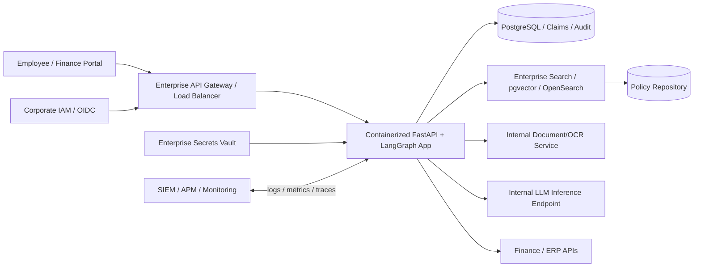
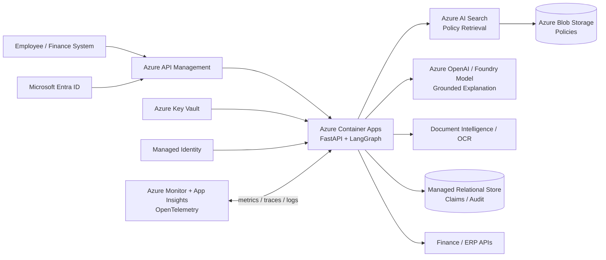

# Deployment Architecture

The logical application remains unchanged across hosting models. Only infrastructure implementations change.

## 1. On-Premises Deployment

### On-prem options

**LLM:** self-hosted approved model for strict data residency, or an approved external endpoint through controlled egress.

**Policy retrieval:** existing enterprise search, OpenSearch, or PostgreSQL/pgvector depending on corpus and platform standards.

**Security:** corporate IAM, TLS, network segmentation, secrets vault, least-privilege service accounts, audit/SIEM integration.

## 2. Azure Serverless Deployment

### Azure rationale

- **Azure Container Apps:** managed container runtime and autoscaling without Kubernetes operational overhead.
- **API Management:** authentication, throttling, API policy enforcement.
- **Azure AI Search:** production evolution from the prototype retriever to hybrid/vector policy retrieval.
- **Azure OpenAI / Foundry model endpoint:** enterprise-managed LLM endpoint.
- **Blob Storage:** receipt/policy document storage.
- **Key Vault + Managed Identity:** avoid credentials in application code.
- **Monitor / Application Insights:** operational and GenAI telemetry.

## 3. Cloud vs On-Prem Trade-Off

| Area | Azure | On-Prem |
|---|---|---|
| Infrastructure operations | Managed | Organization-operated |
| Scaling | Easier/autoscaling | Capacity planning |
| LLM | Managed endpoint | Self-hosted or hybrid |
| Search | Azure AI Search | Existing search / pgvector / OpenSearch |
| Secrets | Key Vault | Enterprise vault |
| Identity | Entra ID | Corporate IAM |
| Observability | Azure Monitor/App Insights | Enterprise SIEM/APM |
| GPU operations | None for managed LLM | Required for self-hosted LLM |
| Initial delivery effort | Lower | Higher |
| Physical data control | Cloud governance controls | Maximum local control |

## 4. Scale-Out Evolution

The prototype is synchronous. At higher volume, the API can return `202 Accepted`, enqueue a claim, process it in a worker, persist the outcome, and notify Finance. This is an evolution path, not required for the one-day MVP.
